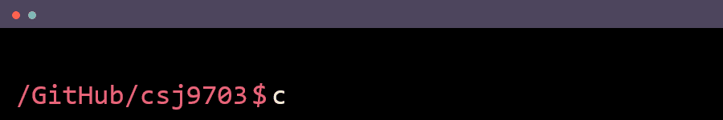

<h1>Back-end Developer</h1>

---

     
  
  

<!-- --- -->
  
 

<!-- 
<h2>My Stats</h2>
 -->
<!--  -->
<!--  -->

<!--
**csj9703/csj9703** is a ✨ _special_ ✨ repository because its `README.md` (this file) appears on your GitHub profile.

Here are some ideas to get you started:

- 🔭 I’m currently working on ...
- 🌱 I’m currently learning ...
- 👯 I’m looking to collaborate on ...
- 🤔 I’m looking for help with ...
- 💬 Ask me about ...
- 📫 How to reach me: ...
- 😄 Pronouns: ...
- ⚡ Fun fact: ...
-->
